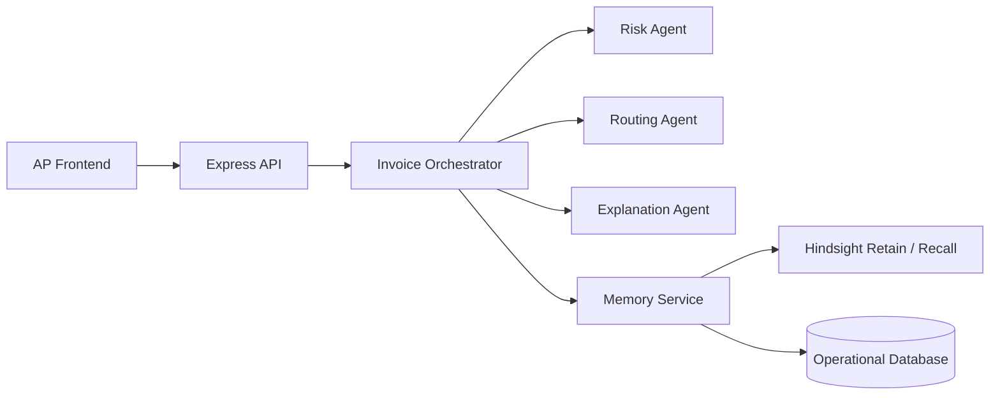

# Why Hindsight Fits Invoice Routing Better Than Another Prompt

Most agent failures I’ve debugged were not model failures. They were memory failures.

That was the big lesson for me while building this Accounts Payable agent. The hard part was never getting an LLM to summarize an invoice. The hard part was getting the system to remember that Swift Logistics routinely omits details, that GlobalTech keeps triggering GST issues, or that a certain vendor’s large invoices usually end up in CFO review. Without that memory, every invoice becomes a fresh investigation, and the agent is basically just a stateless wrapper around a prompt.

I wanted something better than that.

## What I Built

The system in this repo is an accounts payable workflow that analyzes invoices, retrieves vendor history, routes approvals, and stores the outcome as reusable organizational memory.

At the UI layer, the app exposes the exact views a finance team would expect:

- Dashboard
- Invoice Inbox
- Vendor Intelligence
- Exception Log
- Memory Explorer
- Decision Audit
- Settings

Under the hood, the backend does something more interesting than simple CRUD. It takes a new invoice, pulls vendor-specific context, computes risk, decides how to route the invoice, writes an explanation, and stores the result as a future memory.

The front door is straightforward. New invoices enter through the inbox or through OCR-assisted upload. The backend persists them as pending work, and an autopilot loop picks them up when automation mode is enabled.

## The Real Problem Wasn’t OCR or Routing

OCR is useful. Routing logic is useful. Neither is the hard part.

The hard part is repeated judgment.

A finance team doesn’t struggle because it can’t parse the invoice number. It struggles because similar exceptions keep coming back, and the knowledge needed to handle them lives in people, email threads, and half-remembered approval decisions.

That is why the center of this project is not the model call. It is the memory layer.

In the current repo, that memory is implemented with a durable `memory_events` table plus retrieval logic around vendors, exceptions, and prior decisions. That gave me a retain/recall shape immediately, which is exactly why I think [Hindsight agent memory](https://github.com/vectorize-io/hindsight) fits this kind of system so well. The architecture already wants a memory substrate. I just made that explicit.

## How The System Hangs Together

The invoice orchestration flow is where the design becomes opinionated. When a new invoice arrives, the backend does all of the following in one path:

1. Load the invoice
2. Load global approval settings
3. Retrieve vendor memory
4. Run risk analysis
5. Run approval routing
6. Generate reasoning
7. Update the invoice status
8. Insert a decision record
9. Write a new memory event

This is the heart of the system:

```ts
const vendorMemory = await retrieveVendorMemory(invoice.vendorId);

let risk;
try {
  risk = await runRiskAgent(invoiceData, vendorMemory);
} catch {
  risk = calculateBasicRisk(Number(invoice.amount), vendorMemory);
}

const routing = await runRoutingAgent(
  risk,
  Number(invoice.amount),
  settings.approvalMode,
  {
    autoApproveThreshold: Number(settings.autoApproveThreshold),
    cfoReviewThreshold: Number(settings.cfoReviewThreshold),
    managerReviewThreshold: Number(settings.managerReviewThreshold),
  },
);
```

That flow comes from [orchestrator.ts](file:///c:/Users/theco/Desktop/Agent-Orchestration-Audit/Agent-Orchestration-Audit/artifacts/api-server/src/agents/orchestrator.ts#L36-L67). The important detail is not that the risk agent exists. It’s that the risk agent runs after memory retrieval, not before.

That sounds obvious, but a lot of agent systems get this backward. They ask the model to decide first and then bolt on “context” later. For AP, that’s the wrong order. Context is the decision.

## The Memory Model Is The Interesting Part

The current implementation stores memory as explicit events tied to vendors and optionally to invoices. That matters because it keeps the reasoning trail durable and queryable.

The write path is intentionally small:

```ts
export async function writeMemoryEvent(data: {
  vendorId: number;
  invoiceId?: number;
  eventType: string;
  content: string;
  importance?: number;
  tags?: string;
}): Promise<void> {
  await db.insert(memoryEventsTable).values({
    vendorId: data.vendorId,
    invoiceId: data.invoiceId ?? null,
    eventType: data.eventType,
    content: data.content,
    importance: data.importance ? String(data.importance) : null,
    tags: data.tags ?? null,
  });
}
```

That comes from [memory-agent.ts](file:///c:/Users/theco/Desktop/Agent-Orchestration-Audit/Agent-Orchestration-Audit/artifacts/api-server/src/agents/memory-agent.ts#L65-L82).

I like this design for two reasons.

First, it forces me to store memory as something operationally meaningful, not as an opaque blob. A vendor pattern, a dispute, a previous resolution, or an autopilot failure can all become first-class memory records.

Second, it makes the Hindsight integration point obvious. If I move this system from a database-only memory layer to [Hindsight’s documentation-backed agent memory model](https://hindsight.vectorize.io/), I don’t have to redesign the product. I just change how retain and recall are implemented behind the same workflow.

That is a much healthier place to be than starting with a model-heavy architecture and trying to retrofit memory later.

## Why I Chose Rule-Based Routing After Memory Retrieval

I was tempted to let the model fully decide routing. I’m glad I didn’t.

Approval routing is one of those places where explicit business policy beats cleverness. The system already knows thresholds for auto-approve, manager review, CFO review, and high-risk escalation. That logic belongs in code, where it is testable and inspectable.

The routing agent stays simple on purpose:

```ts
if (approvalMode === "auto") {
  if (risk.riskLevel === "low" && amount <= thresholds.autoApproveThreshold) {
    return { action: "approve", reasoning: "Auto mode: low risk and within auto-approve threshold", confidence: 90 };
  }
  if (risk.riskLevel === "high" || amount > thresholds.cfoReviewThreshold) {
    return { action: "cfo_review", reasoning: "Auto mode: high risk or above CFO threshold", confidence: 95 };
  }
}
```

That snippet is from [routing-agent.ts](file:///c:/Users/theco/Desktop/Agent-Orchestration-Audit/Agent-Orchestration-Audit/artifacts/api-server/src/agents/routing-agent.ts#L23-L37).

This is one of the biggest practical takeaways from the project: let memory shape the judgment, but let policy own the approval path.

If you hand both of those jobs to the model, you get a system that is harder to debug and harder to explain.

## A Concrete Before/After Example

Before adding a memory-centric flow, a new high-value invoice from a vendor like GlobalTech would be treated mostly as a threshold problem:

- Amount is high
- Send for review

That works, but it is shallow. It doesn’t know why this vendor is risky beyond the current invoice.

After adding memory retrieval, the same decision can incorporate:

- Repeated GST mismatches
- Prior duplicate invoice patterns
- Recent unresolved exceptions
- A declining vendor trust score
- Past decisions for similar invoice amounts

That means the recommendation is not just “this number is large.” It becomes “this invoice is large, the vendor has unresolved tax issues, and similar historical cases required escalation.”

That behavior shows up in the design of the dashboard, memory explorer, and decision audit, but it is enforced in the backend. The agent does not just store final outcomes. It stores enough context to make the next decision better.

## Where I’d Put Hindsight In This Stack

The repo already implements a custom memory layer, but the retain/recall boundary is clear enough that I’d treat Hindsight as the durable memory backbone for production.



Operational state still belongs in the database. But the memory service is where I want better recall semantics, richer historical retrieval, and a cleaner boundary between “store the event” and “retrieve context that matters now.”

That is also why the [Vectorize explanation of agent memory](https://vectorize.io/what-is-agent-memory) feels relevant here. AP is not a chatbot problem. It is a repeated-decision problem. Those are exactly the systems that break when memory is treated as an afterthought.

## What I Learned

I came away from this project with a few strong opinions.

### 1. Stateless agents are a dead end for operational workflows

If the job involves repeated judgment, you need memory early in the design, not as a future enhancement.

### 2. Memory should be structured enough to debug

I don’t want “context” to mean a giant blob of text. I want event types, importance, timestamps, tags, and clear relationships to invoices and vendors.

### 3. Let policy stay deterministic

The model is useful for assessment and explanation. Approval thresholds and escalation paths are much safer in code.

### 4. Fallbacks matter more than cleverness

The repo falls back when model calls fail. That is not glamorous, but it is what keeps an automation system usable.

### 5. The right abstraction is retain/recall, not prompt stuffing

Once I built the memory layer cleanly, it became obvious where a dedicated memory system like Hindsight belongs.

## Final Thought

The most useful thing I built here was not an invoice parser or a dashboard. It was a system that stops treating each invoice like a brand-new problem.

That is the bar I now use for any operational agent: if it cannot retain context and recall it when the next similar case appears, it is not really helping. It is just generating text around the same repetitive work.

For this class of system, memory is the product. The rest is orchestration.
