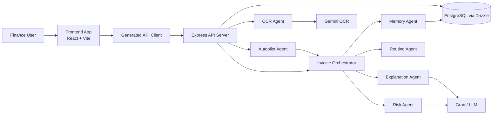
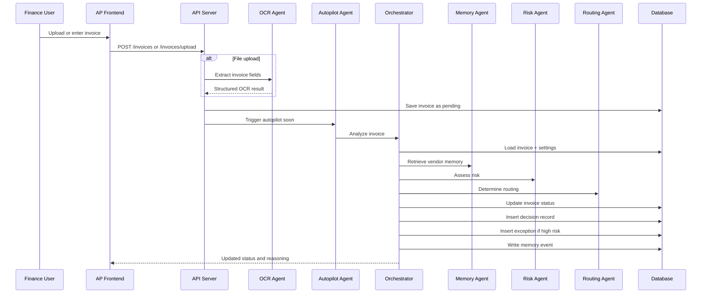
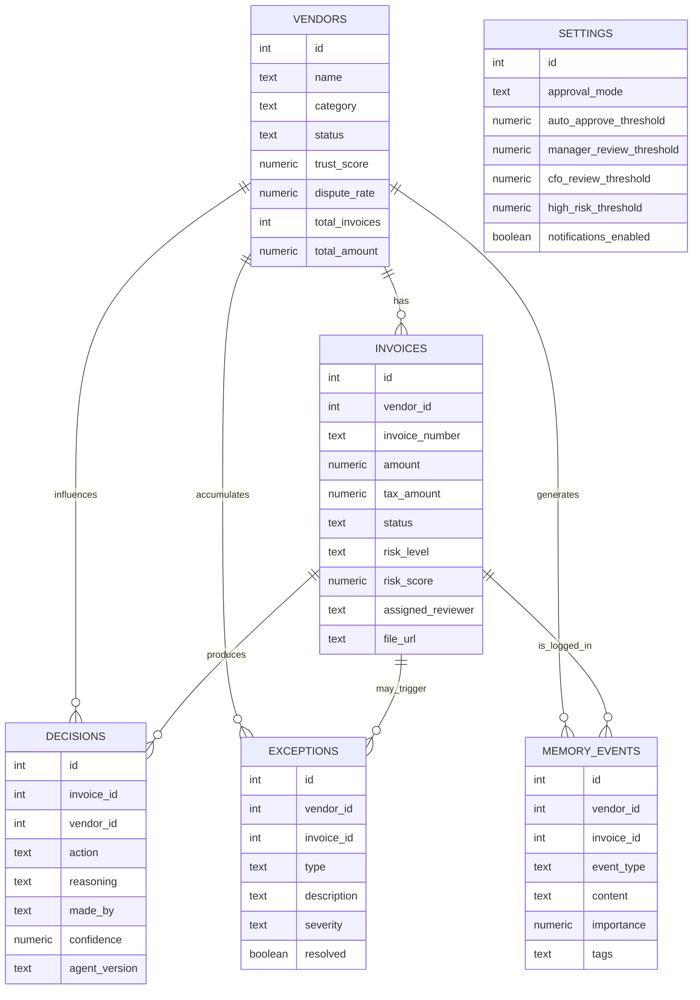
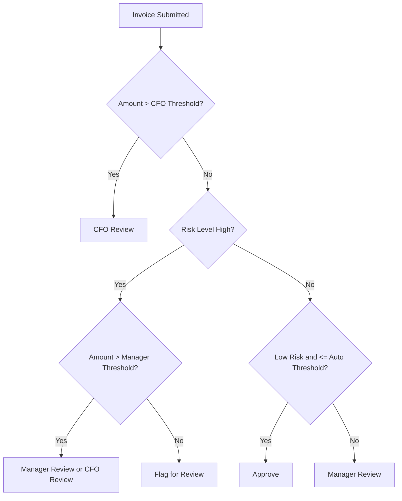

# Accounts Payable Agent
## Final Demo Report

**Project:** AI-Powered Accounts Payable Assistant  
**Repository Basis:** `Agent-Orchestration-Audit`  
**Prepared For:** Final Demo Presentation  
**Prepared On:** 2026-06-07

---

## 1. Executive Summary

The Accounts Payable Agent is an AI-assisted invoice operations platform designed to reduce repetitive manual effort in finance workflows. Traditional AP systems record transactions, but they do not consistently remember how similar exceptions were handled before. As a result, recurring issues such as GST mismatches, missing documentation, high-value approval routing, and vendor-specific invoice anomalies are repeatedly re-investigated by finance teams.

This project addresses that gap by combining operational workflow management with an organizational memory layer. The system does not only capture invoices, vendors, and decisions. It also stores exception history, approval patterns, and memory events that can be reused when similar situations occur again. In practical terms, this means the platform can remember that one vendor frequently triggers tax issues, that another usually requires executive approval due to invoice size, or that a previously disputed surcharge was already resolved using a known resolution pattern.

The implemented solution consists of:

- A modern frontend dashboard for AP operations
- A backend API server for invoice, vendor, exception, decision, memory, and settings management
- A multi-step orchestration pipeline for invoice analysis
- OCR-assisted invoice ingestion for uploaded files
- Vendor memory retrieval and risk-based routing
- A persistent audit trail for AI-generated decisions
- Configurable approval thresholds with autopilot execution mode

The codebase shows that the platform already supports the full demo story presented in the script:

- Dashboard visibility for invoice operations
- Invoice Inbox for live processing
- Vendor Intelligence for behavior profiling
- Exception Log for recurring issue management
- Memory Explorer for historical recall
- Decision Audit for explainability
- Settings for policy-driven routing

Most importantly, the solution demonstrates a shift from transaction processing to institutional memory. Instead of solving the same AP problem multiple times, the platform accumulates knowledge and applies it to future decisions.

---

## 2. Business Problem

In large organizations, finance teams process significant invoice volumes every month. The payment step itself is usually not the hardest part. The real operational challenge lies in the repeated occurrence of known issues:

- Missing purchase order numbers
- Tax or GST mismatches
- Duplicate invoice submissions
- Unexpected surcharges
- High-value invoices needing executive approval
- Vendor-specific dispute behavior

In conventional teams, this knowledge is rarely formalized. It usually exists in:

- Senior AP staff experience
- Email chains
- Historical spreadsheets
- Previous approval records
- Informal vendor notes

This creates four major business problems.

### 2.1 Repetitive Investigation

When a similar invoice arrives, the AP team often starts from scratch. Staff search old email threads, compare historical invoices, and manually verify whether similar issues occurred before.

### 2.2 Decision Inconsistency

Two employees may treat the same situation differently depending on their personal experience. This reduces policy consistency and introduces operational risk.

### 2.3 Knowledge Loss

When experienced team members leave, much of the practical knowledge around vendor behavior and exception handling leaves with them.

### 2.4 Slow Escalation and Approval

High-value or risky invoices are not always escalated immediately because the context is fragmented across systems. This delays approval and extends invoice cycle time.

### Infographic: Core Pain Points

| Operational Pain | Traditional AP Reality | Organizational Impact |
| --- | --- | --- |
| Repeated exceptions | Same issues investigated again | Wasted analyst time |
| Knowledge trapped in people | Expertise is not institutionalized | Dependency on experienced staff |
| Scattered evidence | Data lives in invoices, emails, and approvals | Slow decision making |
| Inconsistent routing | Similar cases handled differently | Compliance and governance risk |
| Low memory reuse | Prior resolutions are not searchable | Reduced efficiency over time |

The Accounts Payable Agent is designed as a response to these exact gaps.

---

## 3. Proposed Solution

The solution is an AI-powered AP assistant that acts as the institutional memory of the finance department. Rather than handling every invoice as an isolated transaction, the platform uses accumulated vendor and exception history to support faster and more consistent decisions.

At a high level, the system performs five functions:

1. Captures invoice data through manual entry or file upload
2. Retrieves historical vendor memory and exception context
3. Assesses invoice risk based on amount, vendor trust, dispute patterns, and prior issues
4. Routes the invoice using configurable approval rules
5. Stores the outcome as reusable organizational memory

### Infographic: Value Proposition

| Traditional System | Accounts Payable Agent |
| --- | --- |
| Processes invoices | Processes and remembers invoices |
| Stores records | Stores context, patterns, and decisions |
| Depends on human memory | Builds institutional memory |
| Applies static workflow | Applies policy plus historical behavior |
| Audits after the fact | Explains decisions in real time |

This combination of workflow, memory, and explainability is the defining innovation of the project.

---

## 4. Product Modules Implemented In The Codebase

The frontend routing confirms that the application is organized into seven business-facing modules:

- Dashboard
- Invoice Inbox
- Vendor Intelligence
- Exception Log
- Memory Explorer
- Decision Audit
- Settings

These modules are implemented in the frontend application and are backed by matching API routes in the server.

### 4.1 Dashboard

The Dashboard is the executive and operations overview layer. It displays:

- Total invoices
- Pending review invoices
- Approved invoices
- Flagged invoices
- Risk distribution
- Exception trends
- Recent activity
- Top vendors

The UI also calculates an automation rate and exposes recent invoice movement. This makes the dashboard useful not only for AP operators, but also for finance leadership tracking operational throughput and risk.

### 4.2 Invoice Inbox

The Invoice Inbox is the operational workbench. It allows users to:

- Search invoices
- Filter by status
- Filter by risk level
- Add invoices manually
- Upload PDFs and images for OCR-assisted extraction
- Open invoice-level details

This aligns directly with the live demo section of the presentation where a new invoice is added and analyzed.

### 4.3 Vendor Intelligence

The Vendor Intelligence module presents vendor-level behavior signals such as:

- Trust score
- Dispute rate
- Total invoices
- Total invoice value
- Vendor category
- Current vendor status

This is the implementation layer behind the presentation claim that the system remembers vendor-specific patterns.

### 4.4 Exception Log

The Exception Log stores historical invoice issues such as:

- Tax mismatches
- Duplicates
- Disputes
- Amount discrepancies
- Delivery-related issues

Exceptions can be resolved, and the resolution writes back into memory so that future similar cases can benefit from the outcome.

### 4.5 Memory Explorer

The Memory Explorer is the most conceptually important module. It lets users browse or search memory events containing historical organizational knowledge. These events include:

- Invoice analysis outcomes
- Vendor behavior patterns
- Resolved exceptions
- Contract review insights
- Autopilot processing traces

The current search implementation uses text matching over memory content, which already supports practical retrieval of previous cases.

### 4.6 Decision Audit

The Decision Audit page provides a reviewable log of decisions with:

- Action taken
- Confidence score
- Reasoning
- Agent version
- Vendor and invoice context

This module is essential for transparency, governance, and user trust.

### 4.7 Settings

The Settings page controls the policy layer of the system, including:

- Approval mode
- Auto-approve threshold
- Manager review threshold
- CFO review threshold
- High-risk threshold
- Notifications
- Autopilot status and manual trigger

This is where business policy becomes executable routing logic.

---

## 5. System Architecture

The implemented system follows a clean layered architecture consisting of presentation, API, orchestration, and persistence layers.

### 5.1 Frontend Layer

The frontend is built with:

- React
- Vite
- TypeScript
- TanStack Query
- Wouter
- Recharts
- Shadcn/Radix UI components

This stack supports a responsive operational UI with polling-based updates for live invoice and autopilot status refresh.

### 5.2 API Layer

The backend API uses Express and exposes endpoints for:

- Invoices
- Vendors
- Exceptions
- Decisions
- Memory
- Settings
- Dashboard stats
- Autopilot status
- OCR upload

This API layer serves as both the business orchestration entry point and the integration surface for future ERP connectivity.

### 5.3 Agent Orchestration Layer

The orchestration layer is where the AP intelligence is applied. The orchestrator retrieves invoice data, loads settings, pulls vendor memory, calculates risk, selects routing, generates explanation, persists decisions, writes memory events, and updates vendor statistics.

### 5.4 Persistence Layer

The persistence model is implemented with Drizzle ORM over PostgreSQL-style schema definitions. The main business entities are:

- Vendors
- Invoices
- Exceptions
- Decisions
- Memory Events
- Settings

This gives the system a durable memory backbone rather than a temporary inference-only architecture.

---

## 6. End-to-End Invoice Processing Flow

The core business journey of the platform starts when an invoice is created or uploaded and ends when a policy-backed decision is stored.

### 6.1 Ingestion

Users can add invoices manually or upload a PDF/image. Uploaded documents are passed to the OCR agent, which extracts:

- Vendor name
- Invoice number
- Invoice date
- Due date
- Amount
- Tax amount
- Payment terms
- Raw text sample

The extracted vendor name is matched against existing vendor records when possible.

### 6.2 Queueing and Autopilot

Once inserted, invoices are saved with a pending status. If approval mode is set to `auto`, the autopilot agent periodically or immediately picks up pending invoices for analysis.

### 6.3 Memory Retrieval

Before making a decision, the orchestrator loads vendor memory, including:

- Recent exceptions
- Recent decisions
- Historical memory events
- Trust score
- Dispute rate

This is the mechanism that makes the system "remember."

### 6.4 Risk Assessment

The risk agent evaluates the invoice using:

- Invoice amount
- Vendor trust score
- Vendor dispute rate
- Unresolved high-severity exceptions
- Prior decision context
- Prior resolution context

If external LLM processing fails, the system falls back to a rule-based risk calculation. This is an important reliability feature for production-readiness.

### 6.5 Routing

The routing agent applies business thresholds and approval mode to select one of the actions:

- `approve`
- `reject`
- `flag`
- `manager_review`
- `cfo_review`

### 6.6 Explanation and Audit

The final recommendation is saved into the decision log along with confidence and reasoning. This supports the Decision Audit module and aligns with explainable AI expectations.

### 6.7 Memory Writeback

After the decision is made, the system writes a new memory event describing what happened. This closes the learning loop and gradually improves organizational recall.

---

## 7. Data Model And Institutional Memory Design

The database design shows that the project is not only a workflow tool. It is intentionally built as a memory-centric AP system.

### 7.1 Why The Memory Model Matters

The `memory_events` table is the core enabler of institutional memory. It captures business knowledge as timestamped reusable events, rather than burying it inside long-form comments or external communications.

Examples from the seeded demo data include:

- Repeated tax issues from GlobalTech Solutions
- Duplicate billing patterns
- SLA breaches and surcharge disputes from logistics vendors
- Preferred vendor behavior from strong performers
- Vendor review holds for disputed suppliers

### 7.2 Vendor Trust Scoring

Vendor trust is not static. The backend recalculates trust score and dispute rate based on exception volume and severity. This means the vendor profile evolves as more operational evidence is collected.

### Infographic: Memory-Centric Data Strategy

| Data Entity | Stores | Business Purpose |
| --- | --- | --- |
| `vendors` | Trust, dispute, status, profile | Vendor intelligence |
| `invoices` | Operational transaction data | Workflow execution |
| `exceptions` | Issues and resolution state | Exception governance |
| `decisions` | Recommendation history | Auditability |
| `memory_events` | Reusable organizational context | Institutional memory |
| `settings` | Policy thresholds and mode | Controlled automation |

---

## 8. Decision Engine Logic

The decision engine in the codebase combines policy thresholds with contextual memory. This is exactly what the presentation emphasizes.

### 8.1 Risk Inputs

The risk score is influenced by several factors:

- High invoice amount
- Low vendor trust score
- Elevated dispute rate
- Unresolved high-severity exceptions
- Tax-related patterns
- Previous decision history

### 8.2 Routing Logic

The routing logic reflects the configured AP policy:

- Low-risk, low-value invoices can be approved automatically
- Medium-risk invoices are flagged or routed to manager review
- High-risk or high-value invoices route to CFO review
- Manual mode forces human oversight

### 8.3 Example: CFO Review Scenario

The demo scenario in the script is directly supported by the codebase logic. If:

- The invoice amount exceeds the CFO review threshold
- The vendor has historical risk context
- Policy mode requires escalation

then the routing outcome becomes `cfo_review`, and the invoice status is updated accordingly.

### 8.4 Explainability Layer

The explanation agent generates the human-readable reasoning that appears in the decision audit. This supports user confidence because the system does not return a black-box label only. It records:

- What was recommended
- Why it was recommended
- How confident the system was
- Which version of the agent produced the decision

### Infographic: AI Decision Stack

| Step | Function | Output |
| --- | --- | --- |
| 1 | OCR / input capture | Structured invoice data |
| 2 | Memory retrieval | Vendor history and prior cases |
| 3 | Risk assessment | Risk score, level, factors |
| 4 | Routing | Approval or escalation action |
| 5 | Explanation | Human-readable reasoning |
| 6 | Persistence | Audit log and memory event |

---

## 9. Dashboard, Visibility, And Operational Control

The dashboard is important because AP transformation is not only about automation. It is also about visibility and control.

The implemented dashboard provides:

- KPI cards for invoice volume and operational status
- Risk distribution charts
- Exception trend chart
- Recent activity panel
- Top vendor ranking
- Automation rate indication

This gives the finance team real-time operational awareness while the system continues processing invoices in the background.

### Why This Matters

An AP automation initiative can fail if users lose transparency. The dashboard prevents that by surfacing:

- What is pending
- What is approved
- What is risky
- Which vendors are driving volume
- Where exceptions are increasing

The Decision Audit and Memory Explorer complement the dashboard by providing depth behind the KPIs.

---

## 10. Demo Data Insights From The Codebase

The seed data provides a realistic and compelling demonstration environment. It includes vendors with distinct behavioral profiles that support the presentation narrative.

### 10.1 High-Risk Vendor Pattern

`GlobalTech Solutions` is seeded with:

- Low trust score
- High dispute rate
- Multiple tax mismatches
- Duplicate invoice patterns
- High-risk memory events

This vendor clearly demonstrates the need for institutional memory.

### 10.2 Moderate-Risk Operational Vendor

`Swift Logistics` is associated with:

- Delivery delays
- Unauthorized surcharge disputes
- Mixed but manageable trust signals

This is a strong example of a vendor whose behavior should influence future review decisions even when invoice values are not extremely high.

### 10.3 Trusted Strategic Vendor

`InfraCore Ltd` is modeled as a preferred vendor with:

- Strong trust score
- Very low dispute rate
- Large invoice volumes
- Routine CFO review due to high amounts rather than risk

This shows the system can distinguish between high-value and high-risk.

### 10.4 Vendor Under Review

`MediaPro Agency` is seeded with:

- Delivery disputes
- Overcharge patterns
- Review status
- Active hold-like behavior

This demonstrates how vendor intelligence can influence procurement and finance controls.

### Infographic: Demo Vendor Profiles

| Vendor | Behavioral Signal | Operational Meaning |
| --- | --- | --- |
| GlobalTech Solutions | Tax mismatch and duplicate patterns | High scrutiny |
| Swift Logistics | SLA and surcharge disputes | Pattern-aware review |
| InfraCore Ltd | High-value but reliable | Executive approval with confidence |
| NexaCloud Services | New vendor with moderate history | Monitor closely |
| MediaPro Agency | Disputes and overcharges | Controlled approval and review |

---

## 11. Governance, Reliability, And Audit Readiness

A strong AP AI system must do more than automate. It must be governable. The codebase already includes several good governance features.

### 11.1 Auditability

Each decision stores:

- Invoice reference
- Vendor reference
- Action
- Reasoning
- Confidence
- Agent version
- Timestamp

This supports internal audit review and post-decision analysis.

### 11.2 Configurable Policy Controls

Approval thresholds are not hardcoded in the UI. They are stored in settings and can be updated dynamically:

- Auto approval threshold
- Manager review threshold
- CFO review threshold
- High-risk threshold
- Approval mode

### 11.3 Fallback Reliability

The architecture includes fallback logic when model calls fail:

- Risk agent falls back to basic calculation
- Explanation generation falls back to a deterministic narrative
- OCR upload returns usable fallback values if extraction fails

This is an important sign of operational resilience.

### 11.4 Controlled Automation

The autopilot agent runs only when approval mode is set to `auto`. This means the business can choose between:

- Full manual review
- Hybrid review
- Fully automatic mode

That flexibility is essential for phased rollout and stakeholder trust.

---

## 12. Business Impact

The Accounts Payable Agent creates value across efficiency, quality, governance, and scalability.

### 12.1 Efficiency Gains

By reusing prior vendor and exception knowledge, the system reduces time spent on:

- Searching historical cases
- Reconstructing vendor behavior
- Interpreting prior approvals
- Repeating common exception triage

### 12.2 Better Decision Consistency

Because the routing logic is policy-backed and memory-aware, similar cases are more likely to receive similar treatment.

### 12.3 Reduced Key-Person Dependency

The solution transforms tacit human knowledge into searchable organizational memory.

### 12.4 Stronger Control Environment

The presence of decision logs, memory traces, and configurable thresholds improves control maturity for AP operations.

### Infographic: Expected Outcomes

| Dimension | Before | After |
| --- | --- | --- |
| Invoice review speed | Manual and repetitive | Faster with memory reuse |
| Exception handling | Person-dependent | Pattern-aware and structured |
| Approval routing | Reactive | Threshold-driven and explainable |
| Knowledge retention | Informal | Institutionalized |
| Audit readiness | Fragmented | Traceable and reviewable |

---

## 13. Future Scope

The presentation mentions future enhancements, and the codebase architecture is well positioned to support them.

### 13.1 Automated Vendor Communication

The next logical extension is for the platform to send vendor-facing messages automatically when recurring issues are detected, such as:

- Missing PO reference
- Tax mismatch
- Duplicate submission warning
- Missing supporting documentation

This could be implemented by attaching communication workflows to exception types and resolution patterns.

### 13.2 Fraud Detection

The current vendor behavior model already lays the foundation for anomaly detection. Future fraud capabilities could monitor:

- Sudden bank detail changes
- Abnormal invoice amounts
- Unexpected payment terms
- Unusual invoice frequency
- Category-to-amount mismatches

### 13.3 ERP Integration

The API-oriented architecture can be extended to connect with:

- SAP
- Oracle
- Microsoft Dynamics

This would allow approved low-risk invoices to flow directly into enterprise finance systems.

### 13.4 Smarter Memory Search

The current memory search is text-based. A future version could use semantic vector retrieval so that conceptually similar issues can be surfaced even when exact terms differ.

### 13.5 Learning Feedback Loop

The next maturity step would be capturing whether finance users accepted or overruled AI recommendations, then feeding that signal back into trust, routing, and explanation quality.

---

## 14. Conclusion

The Accounts Payable Agent is a strong example of applied AI for enterprise operations. The core innovation is not simply automated classification of invoices. It is the conversion of AP processing into a memory-driven system.

The solution already demonstrates the following essential capabilities:

- Operational AP workflow management
- AI-assisted invoice analysis
- Historical vendor memory retrieval
- Rule-based and context-aware approval routing
- Explainable decision logging
- Reusable exception memory
- Configurable automation controls

In summary:

- Traditional AP systems process invoices
- This system processes invoices and remembers outcomes
- That memory becomes a reusable organizational asset

This is exactly why the project is valuable. It does not just save time on one invoice. It compounds learning over time and turns repeated finance work into a continuously improving decision system.

---

## 15. Presentation-Ready Talking Points

Use the following summary while presenting the report:

1. The product solves a real AP pain point: repeated investigation of recurring invoice issues.
2. The system combines workflow, policy rules, and memory rather than acting as a simple chatbot.
3. Every invoice can generate durable knowledge through exceptions, decisions, and memory events.
4. The platform gives finance teams visibility through Dashboard, Audit, and Memory Explorer views.
5. The architecture is extensible enough for fraud detection, ERP integration, and automated vendor communication.

---

## Appendix A: Suggested Report Export Notes

For final submission, export this markdown document to PDF with:

- A title page
- Page numbers
- Corporate branding header/footer
- Diagram rendering enabled for Mermaid
- Optional screenshots from the running application inserted after sections 4, 5, and 10

This document is intentionally structured to produce approximately a 10-page formatted report after PDF export with standard business formatting.
